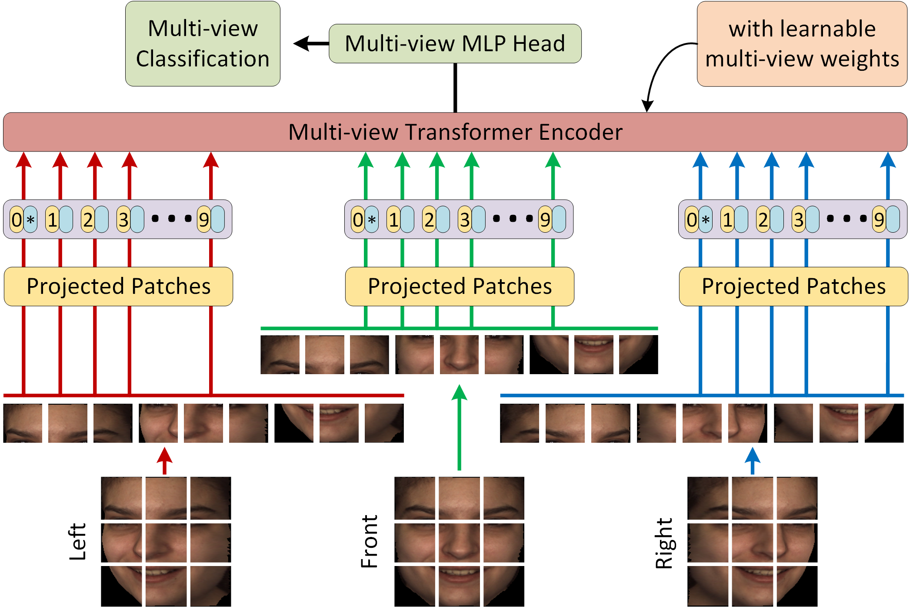

# Multi-view Transformer (MiT)
This repo can be used to work with deep learning models that use multi-views from 3D/4D point clouds. We present MiT: a novel multi-view transformer model for 3D/4D facial affect recognition. MiT incorporates patch and position embeddings from various patches of multi-views and uses them for learning various facial muscle movements to showcase an effective recognition performance.


# Research Article
Note: The research paper based on this repo has been accepted in IEEE Signal Processing Letters 2021.




# MiT's Citation Information
If you use MiT in your research or wish to refer to the results published in the paper, please use the following BibTeX entry:
```@ARTICLE{9534485,  author={Behzad, Muzammil and Li, Xiaobai and Zhao, Guoying},  journal={IEEE Signal Processing Letters},   title={Disentangling 3D/4D Facial Affect Recognition with Faster Multi-view Transformer},   year={2021},  volume={},  number={},  pages={1-1},  doi={10.1109/LSP.2021.3111576}}```
